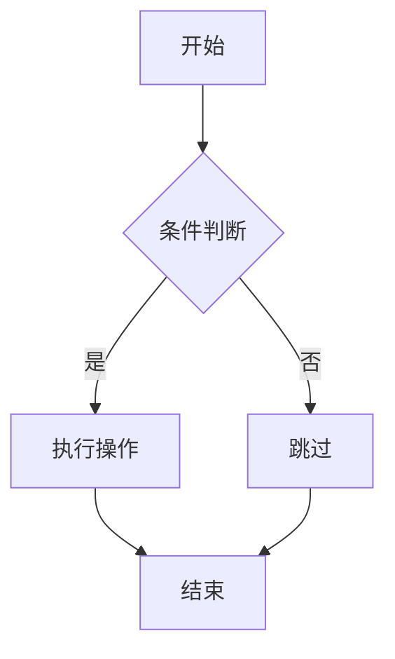
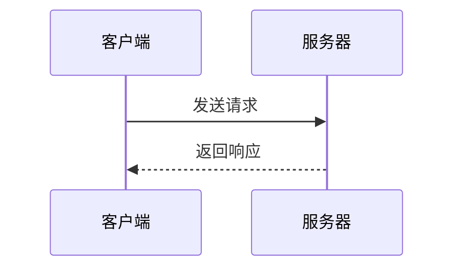
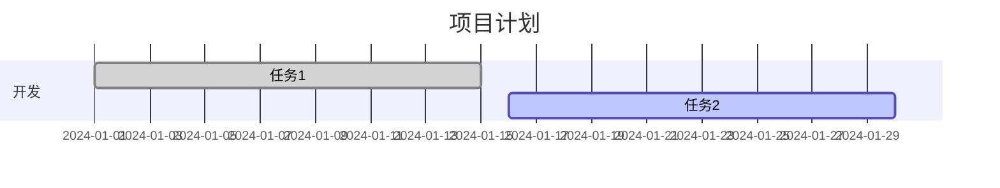
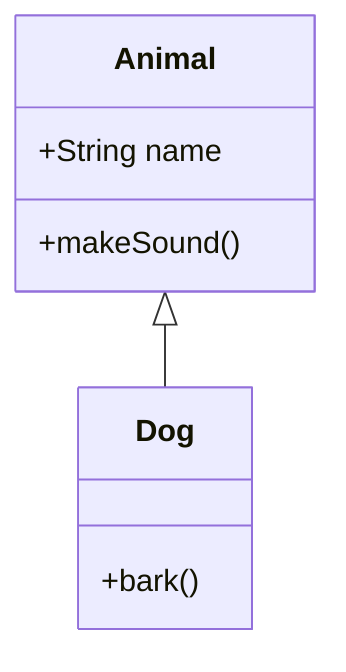
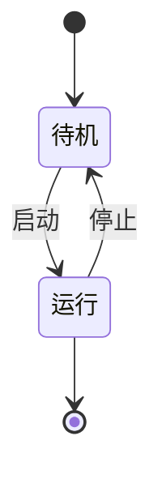
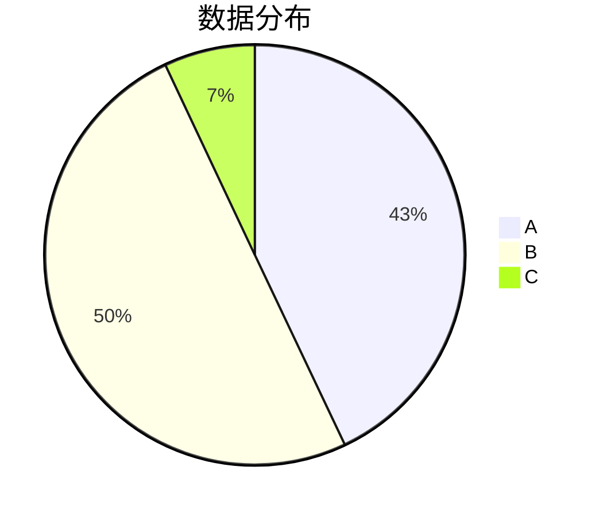
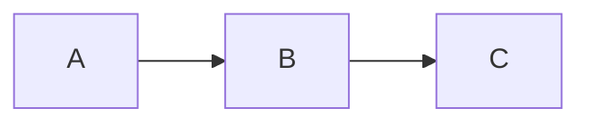

# Mermaid图表支持

markdown-livesync插件现在支持Mermaid图表渲染！

## 功能特性

- ✅ 支持所有主要的Mermaid图表类型
- ✅ 实时预览和同步
- ✅ 错误处理和调试信息
- ✅ 响应式设计，适配不同屏幕尺寸
- ✅ 与现有功能完全兼容
- ✅ 优化的布局居中（修复目录显示时的内容对齐问题）
- ✅ 智能图表尺寸控制（根据复杂度自适应）
- ✅ **节点尺寸自适应优化**：根据节点数量自动调整节点大小
- ✅ **视窗适配优化**：确保图表在一个屏幕内完整显示
- ✅ **交互功能增强**：缩放、平移、全屏等交互控制

## 支持的图表类型

### 1. 流程图 (Flowchart)


### 2. 序列图 (Sequence Diagram)


### 3. 甘特图 (Gantt Chart)


### 4. 类图 (Class Diagram)


### 5. 状态图 (State Diagram)


### 6. 饼图 (Pie Chart)


## 使用方法

### 基本使用

1. 在Markdown文档中使用标准的代码块语法
2. 指定语言为 `mermaid`
3. 在代码块中编写Mermaid图表代码

示例：
````markdown

````

### 交互功能

每个Mermaid图表都支持以下交互功能：

#### 控制按钮
- 🔍+ **放大**：点击放大图表
- 🔍- **缩小**：点击缩小图表
- ↻ **重置**：恢复图表到默认大小和位置
- ⛶ **全屏**：切换全屏模式显示

#### 鼠标操作
- **滚轮缩放**：使用鼠标滚轮进行缩放（50%-300%）
- **拖拽平移**：当图表放大后，可以拖拽移动图表位置
- **悬停显示**：鼠标悬停在图表上时显示控制按钮

#### 键盘快捷键
- **ESC键**：退出全屏模式

### 自适应特性

#### 节点尺寸自适应
- **简单图表**（≤3个节点）：使用较小的节点尺寸，宽度70%
- **中等图表**（≤8个节点）：使用标准节点尺寸，宽度85%
- **复杂图表**（>8个节点）：使用较大的节点尺寸，宽度95%

#### 视窗适配
- 自动调整图表大小以适应屏幕
- 确保图表在一个视窗内完整显示
- 响应式设计支持不同设备

## 技术实现

### 后端处理
- 新增 `mermaidPlugin.ts` 插件
- 识别 `mermaid` 代码块并转换为特殊HTML结构
- 使用 `data-mermaid` 属性存储图表代码，避免HTML转义问题

### 前端渲染
- 集成 Mermaid.js 库 (v10.6.1)
- 自动检测和渲染Mermaid图表
- 错误处理和用户友好的错误显示

### 样式设计
- 响应式图表容器
- 统一的视觉风格
- 错误状态的清晰显示

## 错误处理

如果Mermaid图表语法有误，插件会显示友好的错误信息：

- 错误原因说明
- 原始代码显示
- 调试信息

## 兼容性

- 与现有的markdown-livesync功能完全兼容
- 支持行号同步和光标跟踪
- 目录导航正常工作
- 实时更新功能正常

## 配置

无需额外配置，Mermaid支持开箱即用。

## 依赖项

新增依赖：
- `mermaid`: ^10.6.1 (通过CDN加载)

## 测试

使用提供的 `test-mermaid.md` 文件测试各种图表类型的渲染效果。

## 故障排除

### 图表不显示
1. 检查代码块语言是否为 `mermaid`
2. 验证Mermaid语法是否正确
3. 查看浏览器控制台是否有错误信息

### 渲染错误
1. 检查Mermaid.js库是否正确加载
2. 验证网络连接（CDN加载）
3. 查看错误详情和原始代码

## 更新日志

### v0.1.56 - 增强版本
- ✅ 添加Mermaid图表支持
- ✅ 集成Mermaid.js v10.6.1
- ✅ 实现错误处理机制
- ✅ 添加响应式样式
- ✅ 完善文档和测试用例
- 🔧 **修复布局问题**：改用flexbox布局，确保内容在有目录时正确居中
- 🔧 **修复图表尺寸问题**：
  - 图表宽度调整为根据复杂度自适应（70%-95%）
  - 禁用Mermaid的useMaxWidth限制，让CSS控制尺寸
  - 实现真正的高度自适应，移除固定高度限制
  - 添加响应式设计，在不同屏幕尺寸下优化显示
- ✨ **新增交互功能**：
  - 节点尺寸自适应优化：根据图表复杂度自动调整节点大小
  - 视窗适配优化：确保图表在一个屏幕内完整显示
  - 交互控制增强：缩放、平移、全屏等功能
  - 鼠标滚轮缩放支持
  - 拖拽平移功能（放大后可用）
  - 控制按钮：放大、缩小、重置、全屏
  - 键盘快捷键支持（ESC退出全屏）
