# Markdown LiveSync - VS Code/Cursor 实时预览插件

Markdown LiveSync 是一个为 VS Code 和 Cursor 编辑器设计的 Markdown 实时预览插件，提供无缝的编辑和预览体验。完全集成到 VSCode 内置预览面板中，使用 WebView API 提供高性能的实时预览功能。

作者: [hmslsky](https://github.com/hmslsky)

## 主要功能

### 核心预览功能

- **VSCode内置预览面板**：完全集成到VSCode编辑器中，无需外部浏览器
- **实时预览和自动更新**：编辑内容时即时更新预览
- **分屏显示**：支持编辑器和预览面板并排显示
- **灵活的预览位置**：支持在当前标签页或侧边打开预览
- **智能文档切换**：自动跟随当前活动的Markdown文档

### Markdown 渲染功能

- **标准语法支持**：完整支持标准 Markdown 语法渲染
- **GitHub Flavored Markdown**：支持表格、任务列表等扩展语法
- **代码块语法高亮**：自动高亮显示代码块
- **数学公式渲染**：支持KaTeX数学公式（规划中）
- **表格和复选框**：完美渲染表格和任务列表

### 目录导航功能

- **自动生成目录**：根据文档标题自动生成可导航目录
- **分级折叠展开**：支持按级别折叠/展开，默认折叠到第2级
- **快速跳转**：点击目录项快速跳转到对应位置
- **当前位置高亮**：自动高亮当前浏览位置对应的目录项
- **折叠状态记忆**：记住用户的目录折叠状态

### Mermaid 图表功能

- **实时图表渲染**：支持 Mermaid 图表的实时渲染
- **多种图表类型**：支持流程图、序列图、甘特图、类图、状态图、饼图等
- **主题适配**：自动适配VSCode主题的图表显示
- **高质量渲染**：使用最新Mermaid引擎确保图表质量

### 光标和滚动同步

- **实时内容同步**：编辑器内容变更即时同步到预览
- **光标位置同步**：编辑器光标位置自动同步到预览面板
- **双向滚动同步**：编辑器和预览面板滚动位置同步
- **精确定位**：基于行号的精确位置计算

### 主题和样式

- **自动主题适配**：自动适配 VSCode 当前主题（暗色/亮色）
- **自定义字体设置**：支持字体大小、字体族、行高的个性化设置
- **响应式设计**：适配不同屏幕尺寸和分辨率

### 调试和开发工具

- **调试工具面板**：内置调试工具，方便开发和排查问题
- **行号标记**：支持显示行号辅助定位
- **状态指示**：实时显示同步状态和错误信息
- **性能监控**：内置性能监控和优化工具

## 安装

### 从VSIX安装
1. 下载最新的`.vsix`文件
2. 在VS Code中，选择"扩展"视图（Ctrl+Shift+X）
3. 点击右上角"..."菜单，选择"从VSIX安装..."
4. 选择下载的`.vsix`文件并安装

### 从源码安装
1. 克隆仓库：`git clone https://github.com/hmslsky/markdown-livesync.git`
2. 进入项目目录：`cd markdown-livesync`
3. 安装依赖：`npm install`
4. 编译代码：`npm run compile`
5. 按F5启动调试实例进行测试

## 使用方法

### 启动预览

1. **打开Markdown文件**：在VSCode中打开任意`.md`文件
2. **启动预览**，使用以下任一方式：
   - **快捷键**：`Ctrl+Shift+V` (Windows/Linux) 或 `Cmd+Shift+V` (Mac)
   - **右键菜单**：在编辑器中右键选择"Markdown LiveSync: 打开预览"
   - **命令面板**：`Ctrl+Shift+P` (或 `Cmd+Shift+P`)，输入"Markdown LiveSync: 打开预览"
   - **编辑器标题栏**：点击标题栏中的预览按钮"Markdown LiveSync: 在侧边打开预览"

### 预览功能使用

- **分屏预览**：使用"在侧边打开预览"命令可以实现编辑器和预览并排显示
- **自动更新**：编辑内容时预览会自动实时更新
- **位置同步**：移动编辑器光标时，预览会自动滚动到对应位置

### 目录导航使用

- **快速跳转**：点击目录中的任意标题可快速跳转到文档对应位置
- **折叠控制**：点击目录项前的箭头图标可展开/折叠子级目录
- **全局控制**：使用目录顶部的控制按钮可以一键展开/折叠所有目录项

### Mermaid图表使用

在Markdown文档中创建代码块，指定语言为 `mermaid`，插件会自动渲染图表：

**支持的图表类型**：
- 流程图 (Flowchart)
- 序列图 (Sequence Diagram)  
- 甘特图 (Gantt Chart)
- 类图 (Class Diagram)
- 状态图 (State Diagram)
- 饼图 (Pie Chart)

**示例**：
````markdown

```mermaid
graph TD
    A[开始] --> B{条件判断}
    B -->|是| C[执行操作]
    B -->|否| D[结束]
    C --> D
```

````

### 调试工具使用

- **切换调试工具**：使用快捷键 `Ctrl+Shift+D` (或 `Cmd+Shift+D`) 切换调试工具面板
- **查看同步状态**：调试面板中可以查看当前的同步状态和性能信息
- **错误排查**：当预览出现问题时，可通过调试工具查看详细错误信息

## 配置选项

在VS Code设置中，可以配置以下选项（搜索"markdown-livesync"）：

### 预览设置
- `markdown-livesync.preview.defaultView`: 预览面板的默认显示位置
  - `side`：在侧边打开（默认）
  - `window`：在当前窗口打开
- `markdown-livesync.preview.showToc`: 是否显示目录导航（默认：true）
- `markdown-livesync.preview.syncScroll`: 是否启用滚动同步（默认：true）
- `markdown-livesync.preview.highlightOnScroll`: 滚动时是否高亮目标元素（默认：false）

### 目录设置
- `markdown-livesync.toc.defaultCollapseLevel`: 目录默认折叠级别（默认：2）
- `markdown-livesync.toc.showToggleButton`: 是否显示折叠切换按钮（默认：true）
- `markdown-livesync.toc.highlightCurrentItem`: 是否高亮当前目录项（默认：true）
- `markdown-livesync.toc.rememberCollapseState`: 是否记住折叠状态（默认：true）

### 主题设置
- `markdown-livesync.theme.fontSize`: 预览字体大小（默认：14）
- `markdown-livesync.theme.fontFamily`: 预览字体族（默认：系统字体）
- `markdown-livesync.theme.lineHeight`: 行高（默认：1.6）

### 性能设置
- `markdown-livesync.performance.chunkSize`: 分块渲染大小（默认：1000）
- `markdown-livesync.performance.cacheSize`: 缓存大小（默认：100）
- `markdown-livesync.performance.lazyLoad`: 是否启用懒加载（默认：true）

### 调试设置
- `markdown-livesync.debug`: 启用调试日志（默认：false）

## 📁 项目结构

```
markdown-livesync/
├── src/                     # 源代码
│   ├── app.ts              # 插件入口点
│   ├── core/               # 核心功能模块
│   │   └── extension-service.ts # 插件核心服务
│   ├── preview/            # 预览系统
│   │   ├── markdown-preview-panel.ts # 预览面板实现
│   │   └── toc-provider.ts           # 目录导航提供者
│   ├── markdown/           # Markdown处理
│   │   ├── markdown-processor.ts    # Markdown处理器
│   │   └── plugins/               # 插件系统
│   ├── config/             # 配置管理
│   │   ├── config-manager.ts     # 配置管理器
│   │   └── config-types.ts       # 配置类型定义
│   ├── utils/              # 工具函数
│   │   ├── logger.ts       # 日志工具
│   │   └── file-utils.ts   # 文件工具
│   └── types/              # 类型定义
│       └── index.ts        # 全局类型定义
├── media/                  # WebView资源
│   ├── preview.css         # 预览样式
│   ├── preview.js          # 预览脚本
│   ├── github-markdown-light.css # GitHub浅色主题
│   └── github-markdown-dark.css  # GitHub深色主题
├── docs/                   # 📚 标准化文档结构
│   ├── README.md          # 文档导航中心
│   ├── guides/            # 用户指南
│   │   ├── quick-start.md     # 快速开始
│   │   ├── configuration.md   # 配置指南
│   │   └── troubleshooting.md # 故障排除
│   ├── design/            # 开发者文档
│   │   ├── 01-project-overview.md    # 项目概览
│   │   ├── 02-architecture-design.md # 架构设计
│   │   ├── 03-module-details.md      # 模块详解
│   │   └── 04-development-guide.md   # 开发指南
│   ├── api/               # API文档
│   │   └── README.md      # API参考
│   ├── examples/          # 使用示例
│   │   └── README.md      # 示例导航
│   ├── mermaid/           # Mermaid专项文档
│   └── refactor/          # 重构记录
├── tests/                  # 测试文件
│   ├── README.md          # 测试文档
│   ├── layout/            # 布局测试
│   └── mermaid/           # Mermaid测试
├── releases/              # 版本发布
│   └── *.vsix            # VSIX发布文件
└── images/                # 图标资源
```

## 📚 文档导航

### 🚀 快速开始
- [5分钟上手指南](docs/guides/quick-start.md) - 快速安装和使用
- [配置指南](docs/guides/configuration.md) - 详细配置选项
- [故障排除](docs/guides/troubleshooting.md) - 常见问题解决

### 👨‍💻 开发者文档
- [架构设计](docs/design/02-architecture-design.md) - 系统架构说明
- [开发指南](docs/design/04-development-guide.md) - 开发环境设置
- [API文档](docs/api/README.md) - 完整API参考

### 📖 使用示例
- [功能演示](docs/examples/README.md) - 各种使用示例
- [测试用例](tests/README.md) - 测试文档和验证

## 开发

### 构建和测试

- `npm run compile`: 编译TypeScript代码
- `npm run watch`: 监视文件变化并自动编译
- `npm run lint`: 运行ESLint检查代码质量
- `npm test`: 运行测试套件

### 调试

1. 在VSCode中打开项目
2. 按F5启动调试实例
3. 在调试实例中打开Markdown文件进行测试

## 技术栈

- **开发语言**: TypeScript
- **运行环境**: Node.js + VSCode Extension API
- **Markdown解析**: markdown-it
- **图表渲染**: Mermaid.js
- **UI框架**: VSCode WebView API

## 版本历史

- **v1.0.1**: 重构版本，从浏览器预览迁移到VSCode内置预览面板
- **v1.0.0**: 初始版本，基于浏览器的预览实现

## 许可证

Apache License 2.0

Copyright 2024 hmslsky

## 贡献

欢迎提交问题报告和功能请求！

如果您想为项目贡献代码：
1. Fork 本仓库
2. 创建您的特性分支 (`git checkout -b feature/AmazingFeature`)
3. 提交您的更改 (`git commit -m 'Add some AmazingFeature'`)
4. 推送到分支 (`git push origin feature/AmazingFeature`)
5. 打开一个 Pull Request

## 联系方式

- 作者: hmslsky
- GitHub: https://github.com/hmslsky/markdown-livesync
- 问题反馈: https://github.com/hmslsky/markdown-livesync/issues
