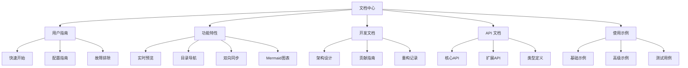

# Markdown LiveSync 文档中心

欢迎来到 Markdown LiveSync 扩展的文档中心。本文档提供了完整的使用指南、功能说明、开发文档和 API 参考。

## 📚 文档导航

### 🚀 快速开始
- [快速上手](guides/quick-start.md) - 5 分钟入门指南
- [用户手册](guides/user-guide.md) - 完整功能使用说明
- [常见问题](guides/faq.md) - 快速解答常见疑问

### 📖 用户指南
- [配置指南](guides/configuration.md) - 详细配置选项说明
- [主题系统](guides/themes.md) - 深浅色主题使用指南
- [故障排除](guides/troubleshooting.md) - 问题诊断与解决

### ✨ 功能特性
- [功能概览](features/overview.md) - 所有功能的综合介绍
- [实时预览](features/preview.md) - 核心预览功能详解
- [目录导航](features/toc.md) - 文档大纲导航系统
- [双向同步](features/sync.md) - 编辑器与预览同步
- [Mermaid 图表](features/mermaid/) - 图表绘制功能专题

### 💻 开发者文档
- [项目概览](development/overview.md) - 项目背景和目标
- [架构设计](development/architecture.md) - 系统架构说明
- [模块详解](development/modules.md) - 各模块实现细节
- [贡献指南](development/contributing.md) - 参与开发指南
- [重构记录](development/refactoring/) - 历史优化记录

### 🔧 API 文档
- [API 概览](api/README.md) - API 文档索引
- [扩展服务](api/extension-service.md) - 核心服务接口
- [配置管理](api/config-manager.md) - 配置系统 API
- [预览面板](api/preview-panel.md) - 预览控制接口
- [目录提供器](api/toc-provider.md) - 目录管理接口

### 📝 使用示例
- [示例概览](examples/README.md) - 所有示例索引
- [基础示例](examples/basic/) - 基本功能演示
- [高级示例](examples/advanced/) - 复杂场景应用
- [测试用例](examples/test-cases/) - 功能测试文档

## 🎯 根据需求查找

### 我是新用户
1. 从[快速开始](guides/quick-start.md)了解基本使用
2. 阅读[用户手册](guides/user-guide.md)掌握全部功能
3. 遇到问题查看[常见问题](guides/faq.md)

### 我要深入了解功能
1. 查看[功能概览](features/overview.md)了解所有特性
2. 阅读具体功能文档深入理解
3. 参考[使用示例](examples/)实际操作

### 我想参与开发
1. 阅读[贡献指南](development/contributing.md)了解流程
2. 理解[架构设计](development/architecture.md)
3. 参考[API 文档](api/)进行开发

### 我遇到了问题
1. 查看[故障排除](guides/troubleshooting.md)
2. 搜索[常见问题](guides/faq.md)
3. 提交 [Issue](https://github.com/your-repo/markdown-livesync/issues)

## 📊 文档结构图

## 🔄 最新更新

- **v0.0.18** - 性能优化版本，大幅提升同步响应速度
- **v0.0.17** - 功能增强版本，完善 Mermaid 支持
- **v0.0.16** - 稳定版本，修复主题切换问题

查看完整[更新日志](../CHANGELOG.md)

## 💡 文档规范

本文档遵循以下规范：
- **结构清晰**：层级分明，易于导航
- **示例丰富**：提供实际可用的代码示例
- **持续更新**：与扩展版本保持同步
- **中文优先**：面向中文用户优化

## 🤝 贡献文档

欢迎帮助改进文档：
1. 发现错误或不清晰的地方
2. 提供更好的示例或说明
3. 翻译成其他语言
4. 添加更多使用场景

详见[文档贡献指南](development/contributing.md#文档贡献)

---

> 📌 **版本信息**：当前文档对应 Markdown LiveSync v0.0.18 版本，最后更新于 2024 年 7 月。 