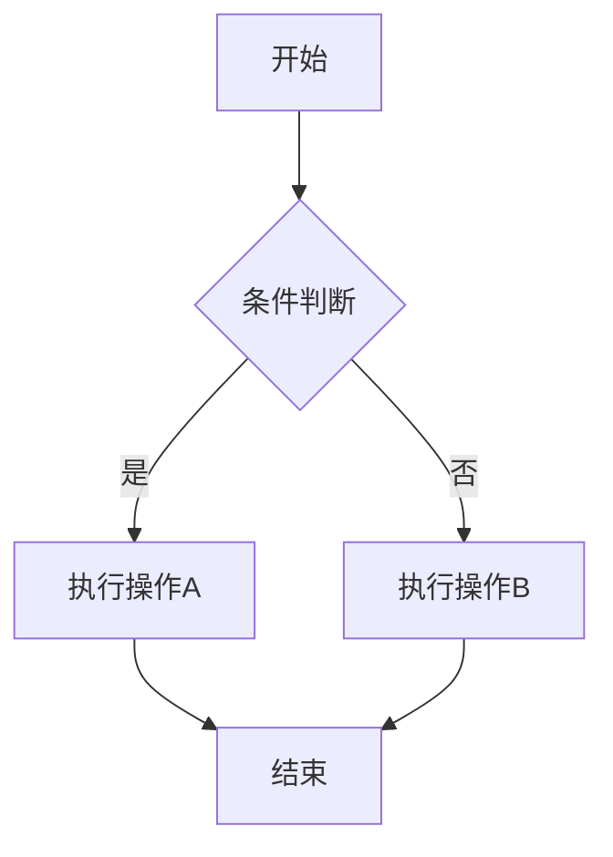
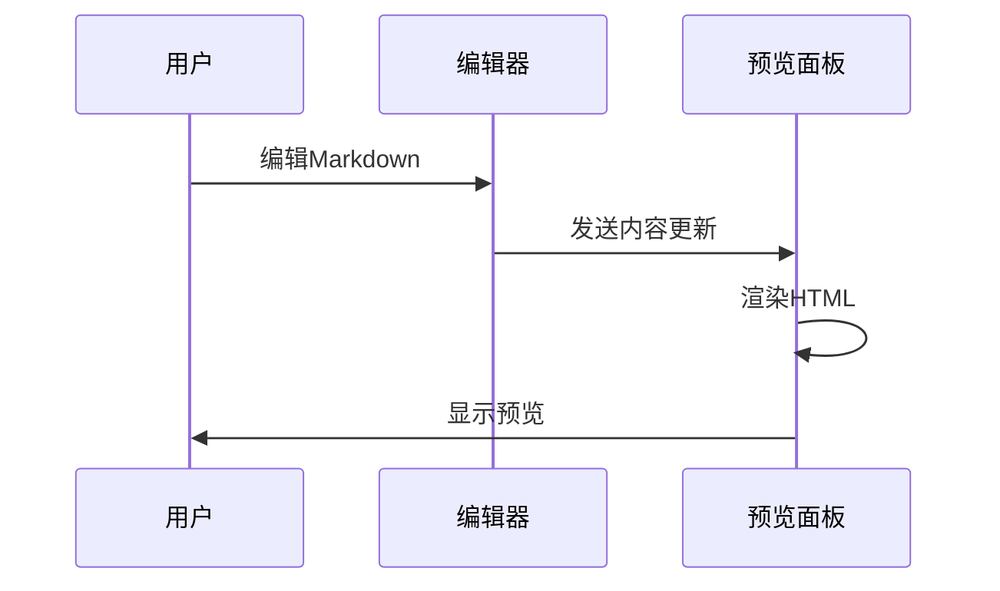
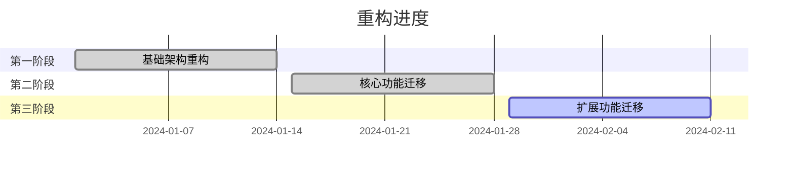

# Markdown LiveSync 重构测试文档

这是一个用于测试重构后功能的Markdown文档。

## 基本功能测试

### 1. 标题层级测试

# 一级标题
## 二级标题
### 三级标题
#### 四级标题
##### 五级标题
###### 六级标题

### 2. 文本格式测试

**粗体文本**
*斜体文本*
~~删除线文本~~
`行内代码`

### 3. 列表测试

#### 无序列表
- 项目1
- 项目2
  - 子项目2.1
  - 子项目2.2
- 项目3

#### 有序列表
1. 第一项
2. 第二项
   1. 子项目2.1
   2. 子项目2.2
3. 第三项

#### 任务列表
- [x] 已完成的任务
- [ ] 未完成的任务
- [x] 另一个已完成的任务

### 4. 代码块测试

```javascript
function hello() {
    console.log("Hello, Markdown LiveSync!");
}

hello();
```

```python
def greet(name):
    return f"Hello, {name}!"

print(greet("World"))
```

### 5. 引用测试

> 这是一个引用块。
> 
> 引用可以包含多行内容。
> 
> > 这是嵌套引用。

### 6. 链接测试

[VSCode官网](https://code.visualstudio.com/)
[内部链接](#基本功能测试)

### 7. 表格测试

| 功能 | 状态 | 说明 |
|------|------|------|
| 预览面板 | ✅ | 使用VSCode Webview |
| 目录导航 | ✅ | 支持折叠展开 |
| 实时同步 | ✅ | 光标和滚动同步 |
| Mermaid图表 | ✅ | 支持交互控制 |

### 8. 分隔线测试

---

## Mermaid图表测试

### 流程图


### 序列图


### 甘特图


## 数学公式测试

行内公式：$E = mc^2$

块级公式：
$$
\int_{-\infty}^{\infty} e^{-x^2} dx = \sqrt{\pi}
$$

## 图片测试


## 测试说明

### 预期行为

1. **预览面板**：应该在VSCode侧边或当前窗口中打开
2. **目录导航**：左侧应显示文档目录，支持点击跳转
3. **实时同步**：编辑内容时预览应实时更新
4. **光标同步**：移动光标时预览应滚动到对应位置
5. **Mermaid图表**：应正确渲染并支持缩放、全屏等操作
6. **调试工具**：按Ctrl+Shift+D应显示/隐藏调试面板

### 测试步骤

1. 打开此文档
2. 使用快捷键 `Ctrl+Shift+V` 打开预览
3. 测试目录导航功能
4. 编辑文档内容，观察实时同步
5. 移动光标，观察滚动同步
6. 测试Mermaid图表交互
7. 切换调试工具显示

### 性能测试

- 大文档渲染速度
- 内存使用情况
- 响应时间
- 缓存效果

## 结论

如果以上所有功能都能正常工作，说明重构成功！🎉
