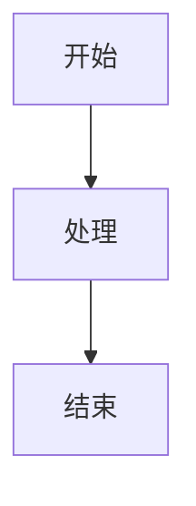

# Mermaid图表功能文档

## 目录

- [功能概述](#功能概述)
- [使用指南](#使用指南)
- [问题修复](#问题修复)
- [技术实现](#技术实现)
- [测试用例](#测试用例)

## 功能概述

Mermaid是一个基于JavaScript的图表绘制工具，支持多种图表类型：
- 流程图（Flowchart）
- 序列图（Sequence Diagram）
- 甘特图（Gantt Chart）
- 类图（Class Diagram）
- 状态图（State Diagram）
- 饼图（Pie Chart）

## 使用指南

### 基本语法

### 图表类型

1. **流程图**
   - 使用`graph`关键字
   - 支持方向：TD（上到下）、BT（下到上）、LR（左到右）、RL（右到左）

2. **序列图**
   - 使用`sequenceDiagram`关键字
   - 支持参与者、消息、注释等

3. **甘特图**
   - 使用`gantt`关键字
   - 支持任务、时间轴、里程碑等

### 交互功能

- 缩放控制（🔍+ 和 🔍-）
- 全屏显示（⛶）
- 拖拽平移
- 重置视图

## 问题修复

详细的修复记录请参考：
- [修复总结](FIXES_SUMMARY.md)
- [升级说明](MERMAID_UPGRADE_SUMMARY.md)
- [功能增强](MERMAID_ENHANCEMENT_SUMMARY.md)

## 技术实现

### 核心功能

1. **渲染引擎**
   - 使用Mermaid.js v10.6.1
   - 自定义渲染配置
   - 错误处理机制

2. **交互控制**
   - 缩放和平移
   - 全屏模式
   - 响应式布局

3. **性能优化**
   - 延迟加载
   - 缓存机制
   - 渲染优化

## 测试用例

测试用例位于`tests/mermaid/`目录下：
- `test-mermaid.md`：基本功能测试
- `test-mermaid-fix.md`：修复验证测试
- `test-mermaid-fixes.md`：综合功能测试
- `test-mermaid-enhanced.md`：增强功能测试

## 相关文档

- [支持说明](MERMAID_SUPPORT.md)：详细的功能支持说明
- [修复总结](FIXES_SUMMARY.md)：问题修复记录
- [升级说明](MERMAID_UPGRADE_SUMMARY.md)：版本升级记录
- [功能增强](MERMAID_ENHANCEMENT_SUMMARY.md)：功能增强记录 