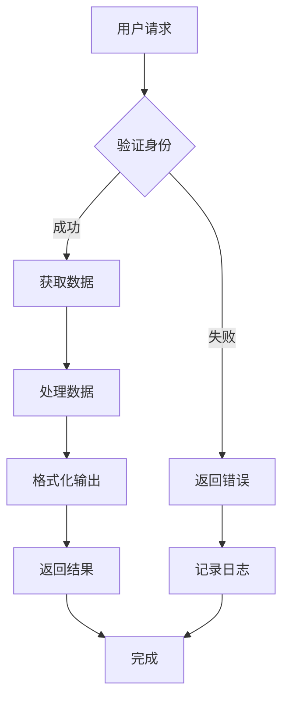
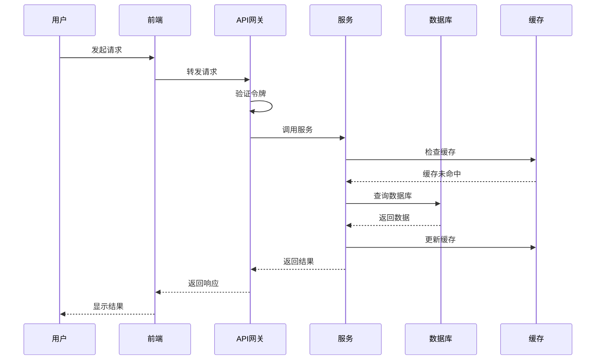
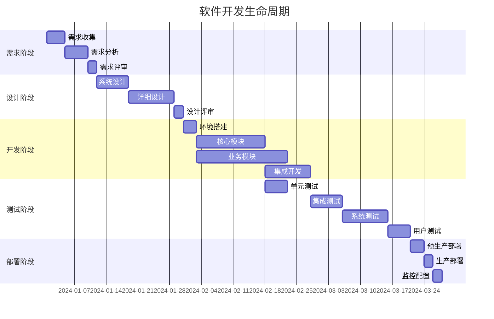

# 布局和Mermaid修复测试

这个文档用于测试修复后的布局和Mermaid图表功能。

## 测试项目

### 1. 布局居中测试

当目录（TOC）显示时，这段文字应该在剩余空间中居中显示，而不是紧贴左侧。

这是一个较长的段落，用于测试文本在有目录时的布局效果。文本应该保持左对齐，但整个内容区域应该在去除目录宽度后的剩余空间中居中。这样可以提供更好的阅读体验，特别是在宽屏显示器上。

### 2. Mermaid图表尺寸测试

#### 小型流程图

#### 中等复杂度流程图

#### 复杂序列图

#### 大型甘特图

## 测试验证点

1. **布局居中**：
   - [ ] 目录隐藏时，内容在整个屏幕中居中
   - [ ] 目录显示时，内容在剩余空间中居中
   - [ ] 文本保持左对齐，不受居中影响

2. **Mermaid图表**：
   - [ ] 图表高度根据内容自适应
   - [ ] 复杂图表不被压缩
   - [ ] 在不同屏幕尺寸下正确显示

3. **响应式设计**：
   - [ ] 在桌面端正常显示
   - [ ] 在平板端正常显示
   - [ ] 在手机端正常显示

## 预期效果

修复后应该看到：
- 更好的内容居中效果
- Mermaid图表有适当的留白（10%）
- 图表高度完全自适应内容
- 在所有设备上都有良好的显示效果
