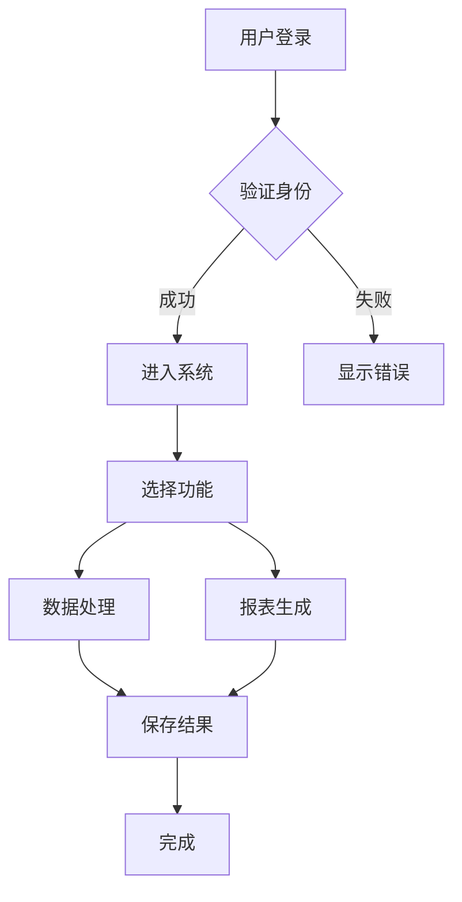
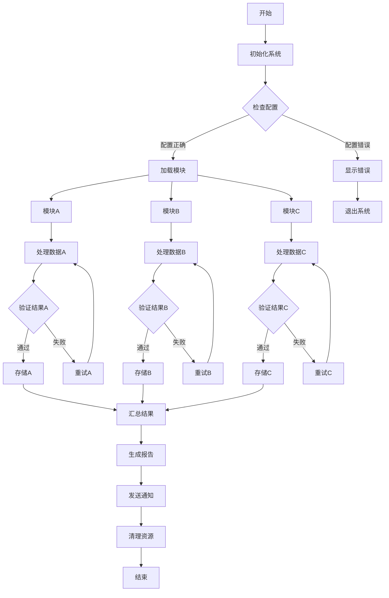
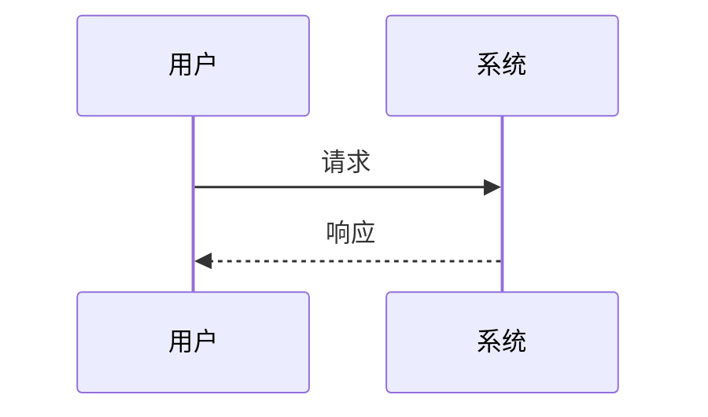
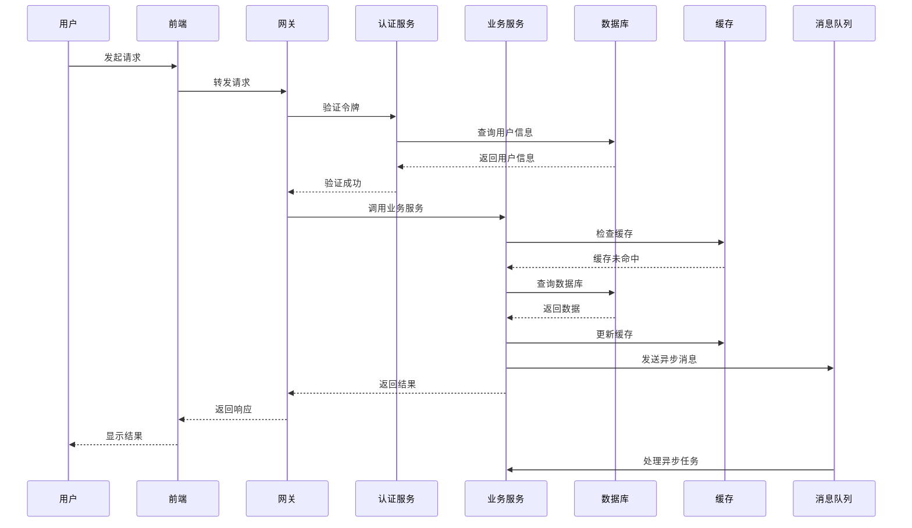
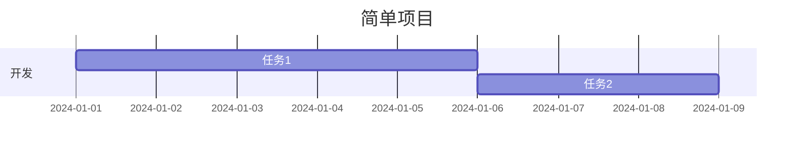
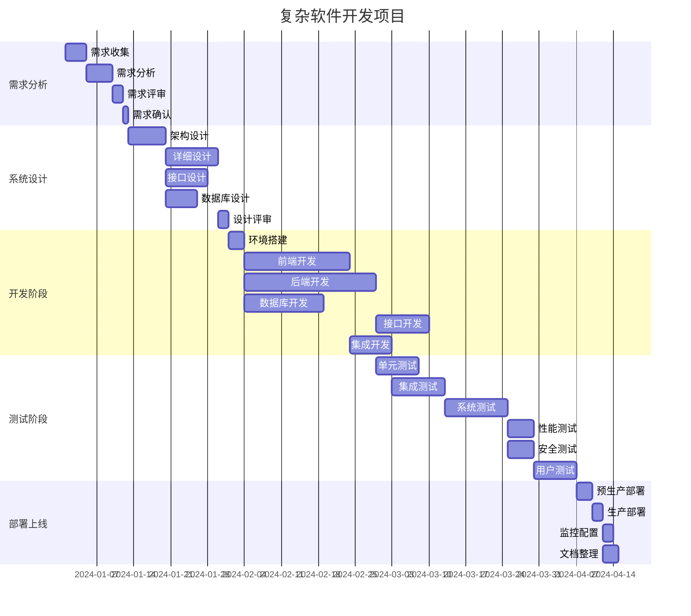

# Mermaid图表增强功能测试

这个文档用于测试Mermaid图表的增强功能，包括节点尺寸自适应、视窗适配和交互功能。

## 测试说明

### 新增功能
1. **节点尺寸自适应**：根据节点数量自动调整节点大小
2. **视窗适配优化**：确保图表在一个屏幕内完整显示
3. **交互功能增强**：
   - 🔍+ 放大按钮
   - 🔍- 缩小按钮
   - ↻ 重置按钮
   - ⛶ 全屏按钮
   - 鼠标滚轮缩放
   - 拖拽平移（放大后）

### 复杂度分类
- **简单图表**：≤3个节点，≤3个连接
- **中等图表**：≤8个节点，≤10个连接
- **复杂图表**：>8个节点或>10个连接

## 简单流程图测试

这是一个简单的流程图，应该显示较小的节点：

## 中等复杂度流程图测试

这是一个中等复杂度的流程图：

## 复杂流程图测试

这是一个复杂的流程图，节点较多：

## 简单序列图测试

## 复杂序列图测试

## 简单甘特图测试

## 复杂甘特图测试

## 测试验证点

### 节点尺寸自适应
- [ ] 简单图表的节点显示较小
- [ ] 中等图表的节点显示适中
- [ ] 复杂图表的节点显示较大

### 视窗适配
- [ ] 所有图表都能在一个屏幕内完整显示
- [ ] 不同设备上都有良好的显示效果
- [ ] 图表不会出现不必要的滚动条

### 交互功能
- [ ] 鼠标悬停时显示控制按钮
- [ ] 放大/缩小按钮正常工作
- [ ] 重置按钮能恢复默认大小
- [ ] 全屏按钮能切换全屏模式
- [ ] 鼠标滚轮缩放功能正常
- [ ] 放大后可以拖拽平移
- [ ] ESC键能退出全屏模式

### 性能测试
- [ ] 图表渲染速度正常
- [ ] 交互操作响应流畅
- [ ] 不影响页面其他功能

## 使用说明

1. **缩放操作**：
   - 使用鼠标滚轮进行缩放
   - 点击🔍+/🔍-按钮进行缩放
   - 缩放范围：50%-300%

2. **平移操作**：
   - 当图表放大超过100%时，可以拖拽平移
   - 鼠标按下并拖动即可平移图表

3. **全屏模式**：
   - 点击⛶按钮进入全屏模式
   - 按ESC键或再次点击按钮退出全屏

4. **重置功能**：
   - 点击↻按钮恢复图表到默认状态
   - 重置缩放比例和位置
