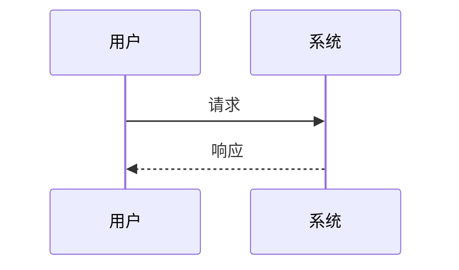
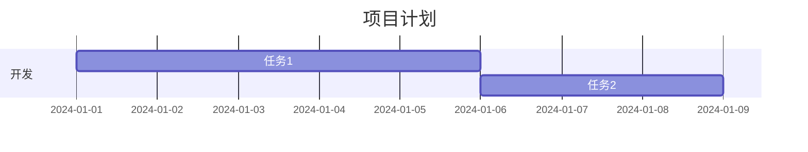
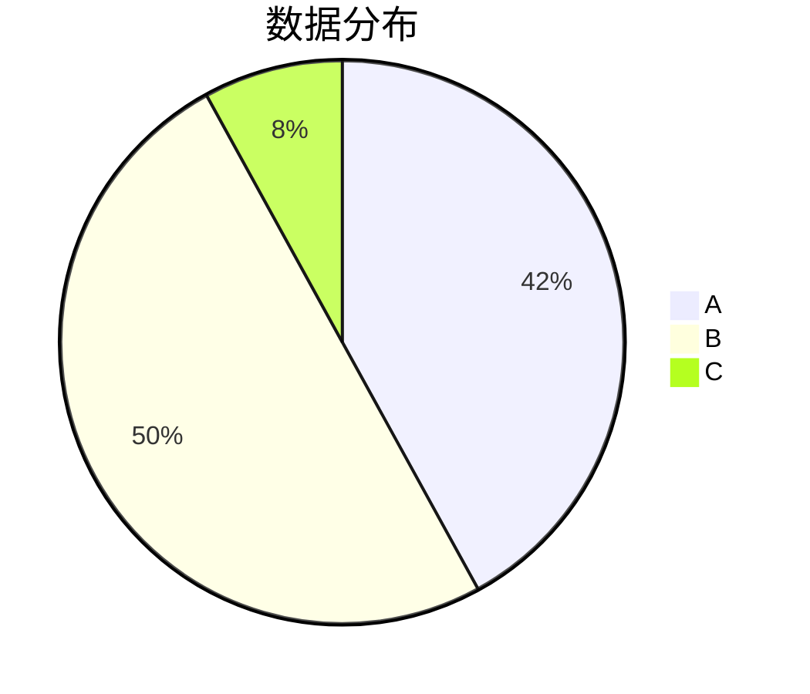
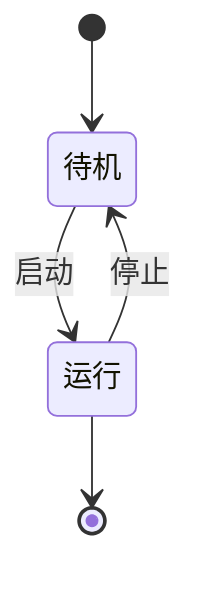

# Mermaid渲染修复测试

这个文档用于测试Mermaid渲染问题的修复。

## 问题描述

之前遇到的错误：`Cannot read properties of undefined (reading 'createElementNS')`

## 修复措施

1. **简化Mermaid配置**：移除了可能导致兼容性问题的复杂配置
2. **改进错误处理**：添加了更详细的错误信息和解决建议
3. **增强DOM检查**：确保元素在渲染前已正确加载到DOM中
4. **兼容性改进**：使用更安全的API调用方式

## 测试用例

### 1. 简单流程图


### 2. 基本序列图



### 3. 简单甘特图



### 4. 饼图



### 5. 状态图



## 验证要点

### 渲染成功指标
- [ ] 图表正常显示，没有错误信息
- [ ] 控制按钮（🔍+、🔍-、↻、⛶）正常显示
- [ ] 鼠标悬停时控制按钮出现
- [ ] 图表可以正常缩放和交互

### 错误处理验证
如果仍有问题，应该看到：
- [ ] 友好的错误信息而不是技术错误
- [ ] 原始代码显示
- [ ] 解决建议提示

### 浏览器控制台检查
打开浏览器开发者工具，检查控制台：
- [ ] 看到"Mermaid初始化完成"消息
- [ ] 看到"Mermaid render函数可用"消息
- [ ] 没有"createElementNS"相关错误
- [ ] 图表渲染成功的日志信息

## 故障排除

如果图表仍然无法渲染：

1. **检查网络连接**：确保可以访问CDN
2. **刷新页面**：重新加载Mermaid库
3. **检查浏览器兼容性**：使用现代浏览器
4. **查看控制台**：检查具体错误信息

## 技术说明

### 修复的关键点

1. **简化配置**：
   ```javascript
   // 修复前：复杂配置可能导致兼容性问题
   mermaid.initialize({
     flowchart: { useMaxWidth: false, nodeSpacing: 50, ... }
   });
   
   // 修复后：简化配置
   mermaid.initialize({
     flowchart: { htmlLabels: true, curve: 'basis' }
   });
   ```

2. **改进渲染逻辑**：
   ```javascript
   // 添加DOM检查
   if (!document.body.contains(element)) {
     console.warn('DOM元素不在文档中');
     return;
   }
   
   // 使用临时容器测试
   const tempDiv = document.createElement('div');
   document.body.appendChild(tempDiv);
   ```

3. **增强错误处理**：
   - 提供具体的错误信息
   - 显示原始代码
   - 给出解决建议

### 预期结果

修复后，所有Mermaid图表应该能够正常渲染，并且提供良好的用户体验和交互功能。
