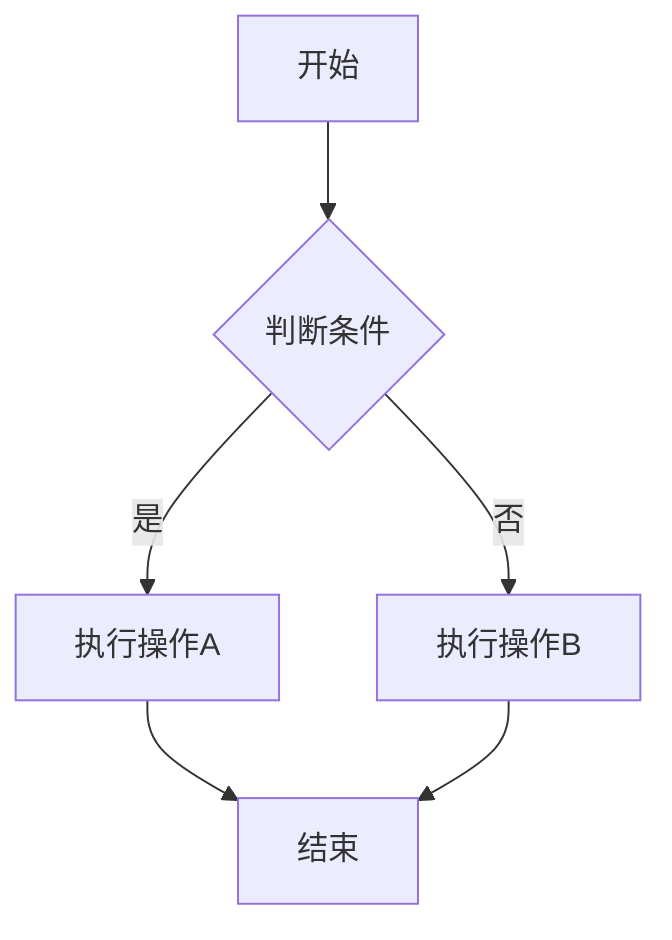
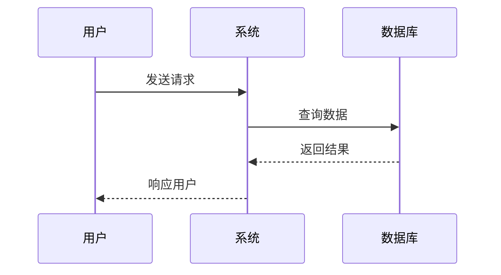
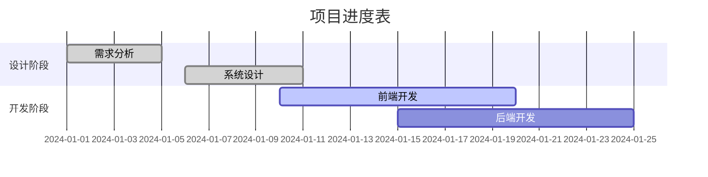
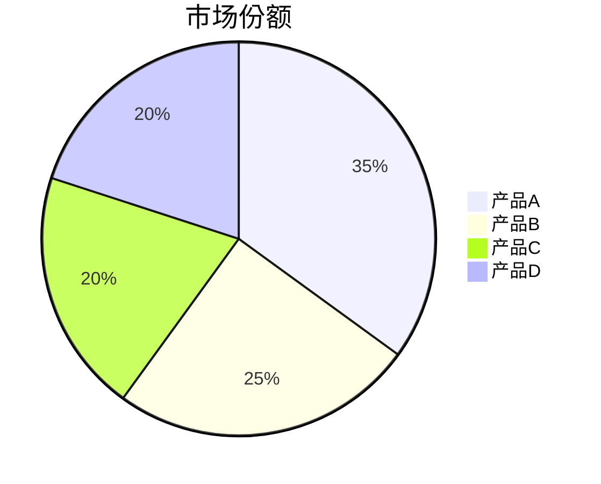

# Mermaid 图表测试

## 流程图测试

```mermaid
graph TD
    A[开始] --> B{判断条件}
    B -->|是| C[执行操作A]
    B -->|否| D[执行操作B]
    C --> E[结束]
    D --> E
```

## 时序图测试

```mermaid
sequenceDiagram
    participant A as 用户
    participant B as 系统
    participant C as 数据库
    
    A->>B: 发送请求
    B->>C: 查询数据
    C-->>B: 返回结果
    B-->>A: 响应用户
```

## 甘特图测试

```mermaid
gantt
    title 项目进度表
    dateFormat  YYYY-MM-DD
    section 设计阶段
    需求分析      :done,    des1, 2024-01-01,2024-01-05
    系统设计      :done,    des2, 2024-01-06, 5d
    section 开发阶段
    前端开发      :active,  dev1, 2024-01-10, 10d
    后端开发      :         dev2, 2024-01-15, 10d
```

## 饼图测试

```mermaid
pie title 市场份额
    "产品A" : 35
    "产品B" : 25
    "产品C" : 20
    "产品D" : 20
``` 