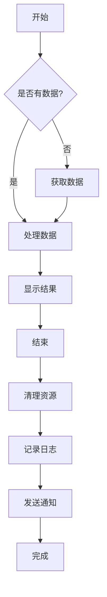
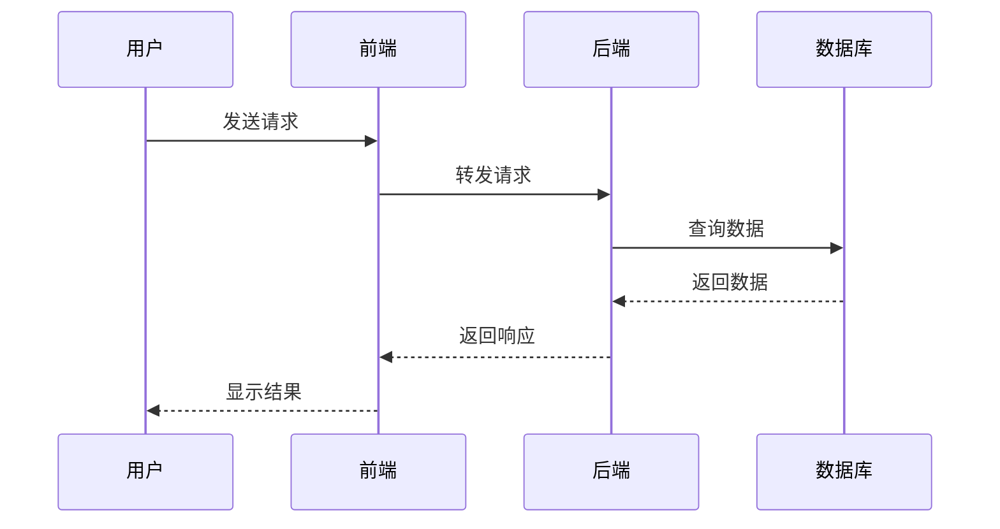
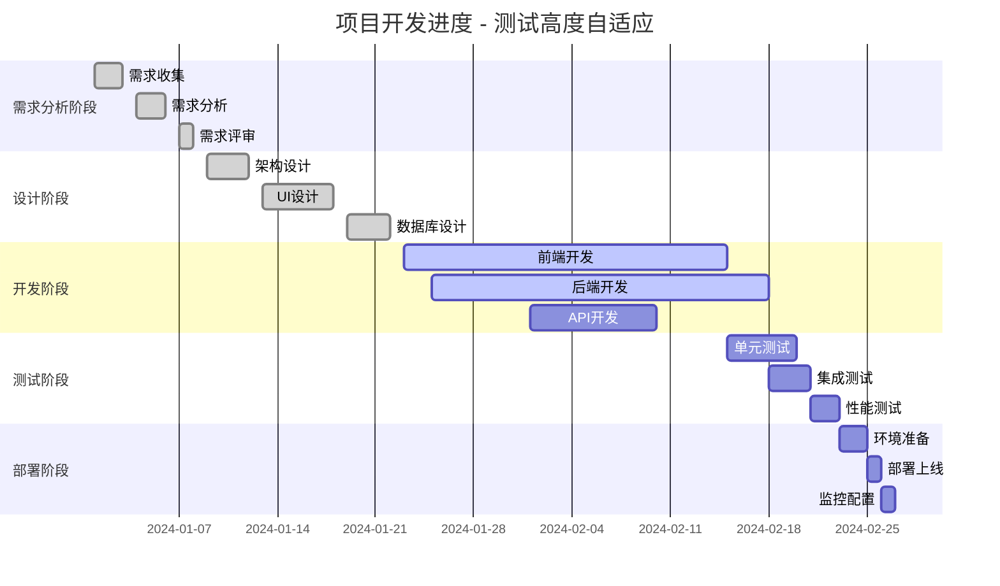
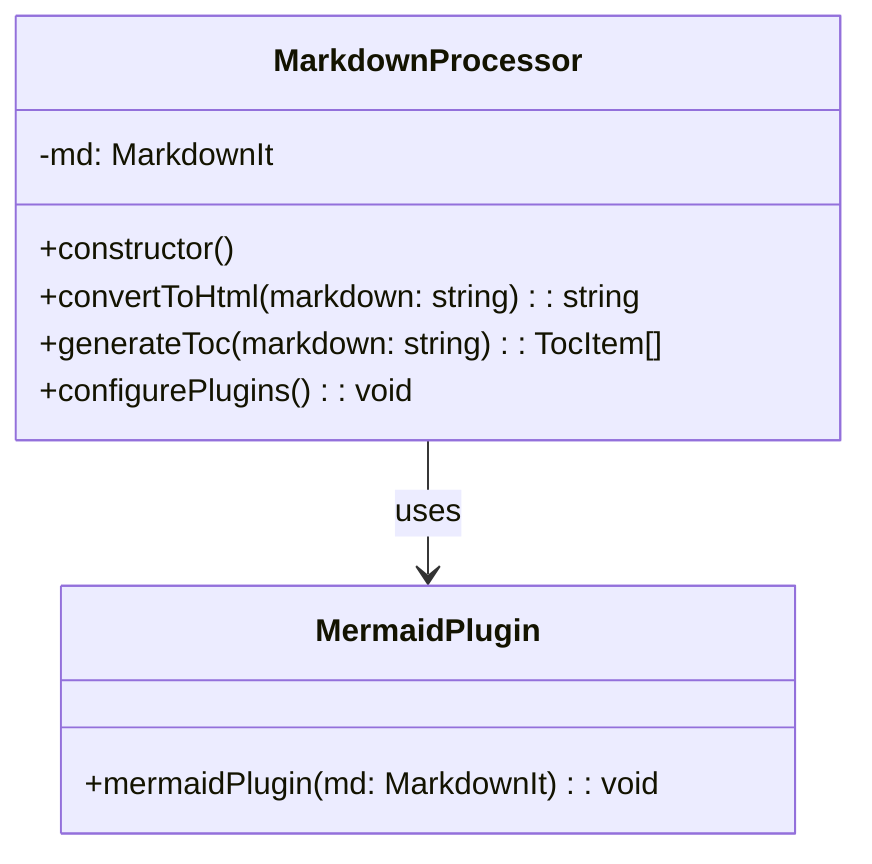
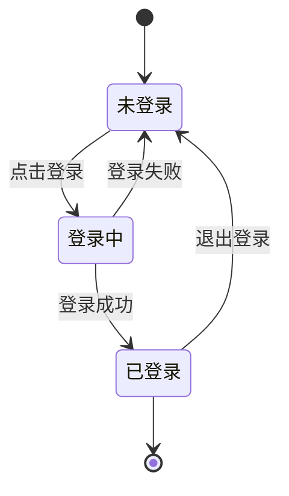
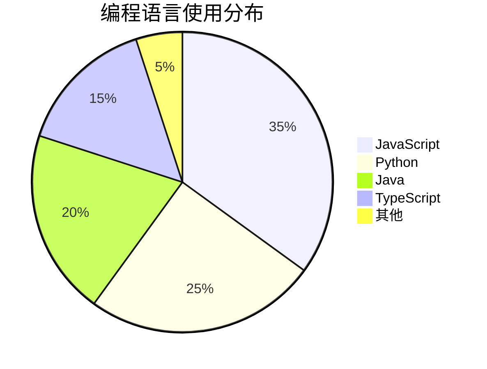

# Mermaid图表测试

这是一个测试Mermaid图表渲染功能的文档，用于验证布局居中和图表尺寸修复。

## 测试说明

1. **布局测试**：当目录显示时，此内容应该在剩余空间中居中显示
2. **图表尺寸测试**：Mermaid图表应该占据容器的100%宽度，高度自适应

## 流程图

下面是一个简单的流程图，测试图表宽度和高度：

## 序列图

这是一个序列图示例：

## 甘特图

项目进度甘特图（测试高度自适应）：

## 类图

简单的类图示例：

## 状态图

用户登录状态图：

## 饼图

数据分布饼图：

这些图表应该能够正确渲染并显示在预览中。
