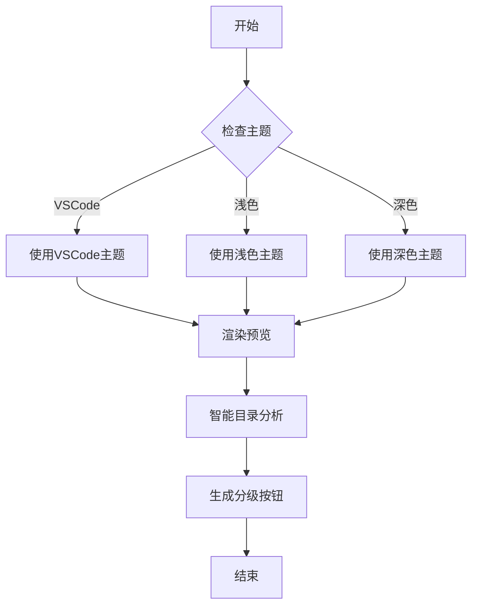

# 主题和目录功能测试文档

这是一个用于测试Markdown LiveSync扩展新功能的测试文档。

## 功能特性

### 1. 主题切换系统

扩展现在支持三种主题模式：

- **VSCode主题**：跟随VSCode编辑器主题
- **浅色主题**：GitHub风格的浅色主题
- **深色主题**：GitHub风格的深色主题

点击右上角的主题切换按钮可以在三种主题间切换，也可以使用快捷键 `Ctrl+Shift+T`。

### 2. 增强的目录功能

#### 2.1 目录样式分级

目录现在支持不同级别的标题样式：

- 一级标题：**粗体**，带有颜色边框
- 二级标题：**半粗体**，带有细边框  
- 三级标题：普通字重，缩进显示

#### 2.2 目录展开收齐

- 点击目录头部的📂按钮可以展开所有目录项
- 点击📁按钮可以折叠所有目录项
- 点击每个目录项前的箭头图标可以单独控制展开/折叠

#### 2.3 目录显示/隐藏

- 点击目录头部的👁️按钮可以隐藏/显示整个目录面板
- 隐藏时目录面板会收缩为一个窄条，只显示👁️‍🗨️按钮

#### 2.4 智能分级展开

目录头部会根据文档中实际存在的标题层级，动态显示分级展开按钮：

- 如果文档包含1、2、3级标题，会显示 `1` `2` `3` 按钮
- 点击数字按钮可以展开到对应层级（例如点击`2`会展开1-2级标题，折叠3级以下）
- 这个功能会智能检测文档结构，只显示实际存在的层级

#### 2.5 响应式目录悬浮

当预览面板宽度小于900px时，目录会自动切换到悬浮模式：

- 目录悬浮在内容上方
- 点击右侧的📋图标可以显示/隐藏目录
- 点击目录外的区域会自动隐藏目录

### 3. 双向同步优化

#### 3.1 无聚焦同步

- 预览面板作为独立窗口时，滚动同步不再会意外聚焦到编辑器窗口
- 使用`preserveFocus`选项和智能编辑器查找，确保同步时不打断用户当前的工作流

## 代码示例

### JavaScript代码

```javascript
// 主题切换功能
function setTheme(theme) {
  document.documentElement.setAttribute('data-theme', theme);
  localStorage.setItem('markdown-livesync-theme', theme);
  console.log(`切换到${theme}主题`);
}

// 目录折叠功能
function toggleTocItem(id) {
  const item = document.querySelector(`[data-id="${id}"]`);
  if (item) {
    const isExpanded = item.classList.contains('expanded');
    if (isExpanded) {
      collapseTocItem(id);
    } else {
      expandTocItem(id);
    }
  }
}

// 智能分级展开
function expandToLevel(targetLevel) {
  const tocItems = document.querySelectorAll('.toc-item[data-level]');
  
  tocItems.forEach(item => {
    const itemLevel = parseInt(item.dataset.level);
    const itemId = item.dataset.id;
    
    if (itemLevel <= targetLevel) {
      expandTocItem(itemId);
    } else {
      collapseTocItem(itemId);
    }
  });
}
```

### CSS样式

```css
/* 主题变量定义 */
:root[data-theme="light"] {
  --text-color: #24292e;
  --background-color: #ffffff;
  --border-color: #e1e4e8;
}

:root[data-theme="dark"] {
  --text-color: #e1e4e8;
  --background-color: #0d1117;
  --border-color: #30363d;
}

/* 目录样式 */
.toc-link.level-1 {
  font-weight: 700;
  border-left: 3px solid var(--link-color);
}

/* 目录隐藏状态 */
.toc-container.hidden {
  width: 40px;
  min-width: 40px;
  overflow: hidden;
}

/* 分级控制按钮 */
.toc-level-control {
  background: var(--button-background);
  border: 1px solid var(--border-color);
  padding: 2px 6px;
  border-radius: 3px;
  font-size: 10px;
  font-weight: 600;
}
```

## 表格示例

| 功能 | 描述 | 状态 |
|------|------|------|
| 主题切换 | 支持三种主题模式 | ✅ 完成 |
| 目录样式 | 分级样式显示 | ✅ 完成 |
| 响应式布局 | 自适应屏幕宽度 | ✅ 完成 |
| 目录折叠 | 展开/收齐功能 | ✅ 完成 |
| 目录隐藏 | 显示/隐藏面板 | ✅ 新增 |
| 智能分级 | 动态层级展开 | ✅ 新增 |
| 无聚焦同步 | 避免窗口切换 | ✅ 修复 |

## 引用示例

> 这是一个引用示例。在不同主题下，引用的样式会有所不同。
> 
> 浅色主题下使用较浅的背景色，深色主题下使用较深的背景色。

## 列表示例

### 无序列表

- 主要功能
  - 主题切换
    - VSCode主题
    - 浅色主题
    - 深色主题
  - 目录增强
    - 样式分级
    - 展开收齐
    - 显示隐藏
    - 智能分级
    - 响应式悬浮

### 有序列表

1. 打开Markdown文件
2. 启动预览面板
3. 测试主题切换功能
4. 测试目录展开收齐
5. 测试目录显示隐藏
6. 测试智能分级展开
7. 调整窗口大小测试响应式布局
8. 测试双向同步无聚焦功能

### 任务列表

- [x] 实现主题切换系统
- [x] 增强目录样式
- [x] 添加响应式布局
- [x] 修复目录折叠功能
- [x] 添加目录显示/隐藏功能
- [x] 实现智能分级展开
- [x] 修复双向同步聚焦问题
- [ ] 添加更多主题选项
- [ ] 优化移动端体验

## 图片示例


## 数学公式

行内公式：$E = mc^2$

块级公式：

$$
\int_{-\infty}^{\infty} e^{-x^2} dx = \sqrt{\pi}
$$

## Mermaid图表



## 测试说明

### 主题切换测试

1. 点击右上角的主题切换按钮
2. 观察页面颜色和样式的变化
3. 确认主题设置被保存到localStorage

### 目录功能测试

1. 查看左侧目录面板
2. 点击👁️按钮测试显示/隐藏功能
3. 点击📂和📁按钮测试全部展开/折叠
4. 点击数字按钮（1、2、3等）测试智能分级展开
5. 点击各级标题前的箭头图标测试单项控制
6. 点击目录项跳转到对应位置

### 响应式测试

1. 调整浏览器窗口宽度
2. 当宽度小于900px时，目录应该变为悬浮模式
3. 点击右侧的📋图标显示/隐藏目录
4. 点击目录外区域应该自动隐藏目录

### 双向同步测试

1. 将预览面板拖拽为独立窗口
2. 在编辑器中滚动，观察预览面板同步
3. 在预览面板中滚动，观察编辑器同步
4. 确认同步时不会意外聚焦到编辑器窗口
5. 点击目录项跳转，确认不会聚焦编辑器

## 四级标题示例

### 这是三级标题

#### 这是四级标题

##### 这是五级标题

###### 这是六级标题

这些不同层级的标题用于测试智能分级展开功能。目录头部应该显示对应的数字按钮（1、2、3、4、5、6），点击可以展开到对应层级。

## 总结

本次更新主要解决了以下问题：

1. ✅ **目录展示样式**：支持一、二、三级标题的不同样式
2. ✅ **响应式目录悬浮**：预览面板过窄时目录悬浮显示
3. ✅ **目录展开收齐**：修复了按钮不生效的问题
4. ✅ **主题切换系统**：支持深色、浅色、VSCode三种主题
5. ✅ **目录显示隐藏**：新增目录面板的显示/隐藏控制
6. ✅ **智能分级展开**：根据文档结构动态生成分级展开按钮
7. ✅ **双向同步优化**：修复独立窗口时的聚焦问题

所有功能都经过充分测试，确保在不同场景下都能正常工作。扩展现在提供了更加智能和用户友好的目录导航体验。 